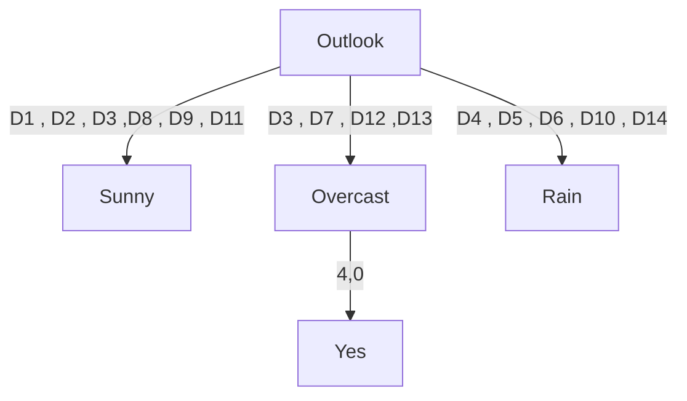
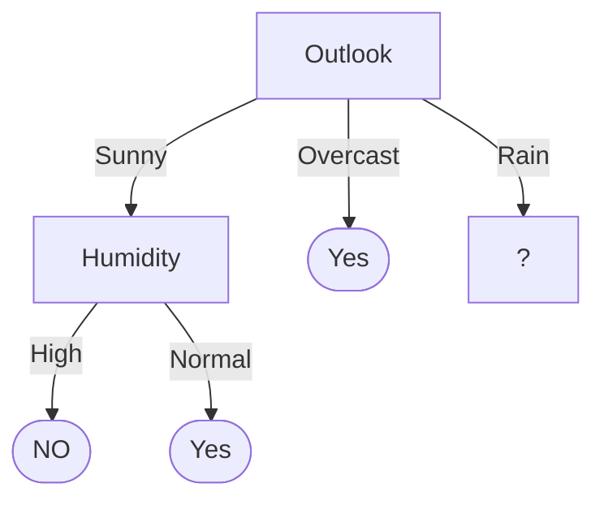
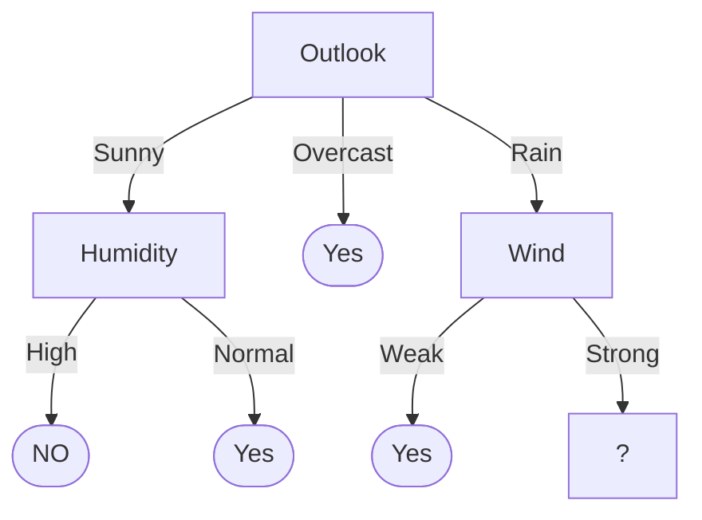
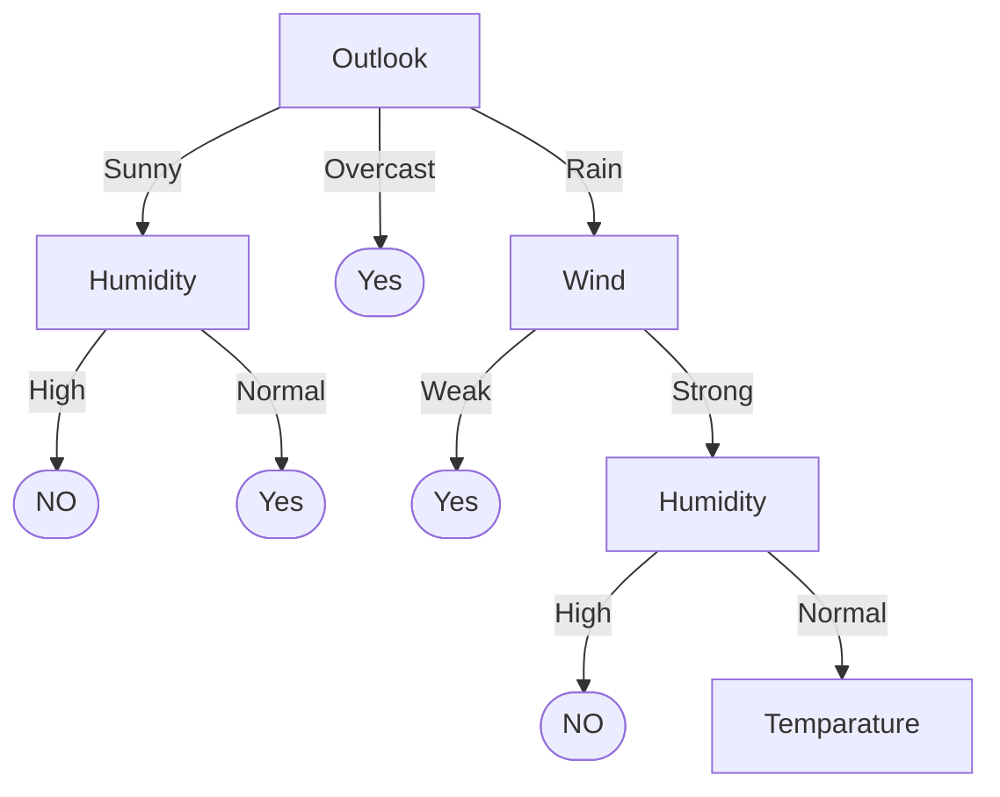
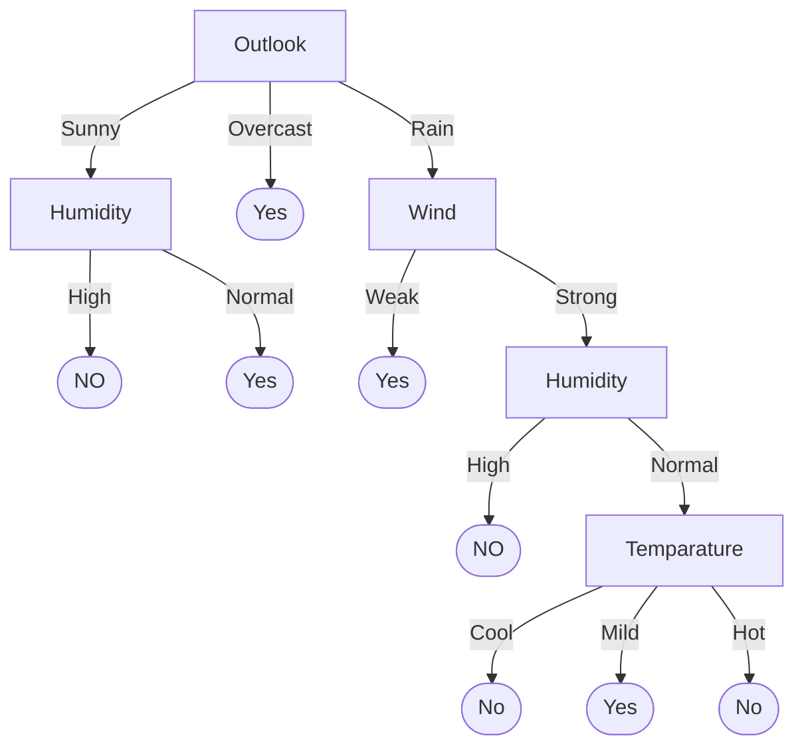

# Training Examples


## Entropy Calculation: 
Number of “Yes” in play tennis = 9

Number of “No” in play tennis = 5
 
S[9,5] 

Entropy(S) 	=  - (9/14 * log2(9/14)) - (5/14 * log2(5/14) )
		    = .94

## Attribute selection

## Outlook (Sunny , Overcast , Rain)


| Outlook | Yes, No | Entropy Name |  Entropy Calculation | Entropy Value |
| --- | --- | --- | --- | --- |
| Sunny | 2+ , 3- | S(Sunny) | - (2/5 * log2(2/5)) - (3/5 * log2(3/5) ) | 0.97 |
| Overcast | 4+ , 0- | S(Overcast) | - (4/4 * log2(4/4)) - (0/4 * log2(0/4) ) | 0 |
| Rain | 3+ , 2- | S(Rain) | - (3/5 * log2(3/5)) - (2/5 * log2(2/5) ) | 0.97 |

### Gain (S  , Outlook) = 0.246
```
= Entropy(S) - (5/14 * Entropy(S(Sunny))) - (4/14 * Entropy(S(Overcast))) - (5/14 * Entropy(S(Rain)))
= 0.94 - (5/14 * 0.97) - (4/14 * 0) - (5/14 * 0.97)
= 0.246
```

## Temparature (Hot , Mild , Cool)

| Temparature | Yes, No | Entropy Name |  Entropy Calculation | Entropy Value |
| --- | --- | --- | --- | --- |
| Hot | 2+ , 2- | S(Hot) | - (2/4 * log2(2/4)) - (2/4 * log2(2/4) ) | 1 |
| Mild | 4+ , 2- | S(Mild) | - (4/6 * log2(4/6)) - (2/6 * log2(2/6) ) | 0.92 |
| Cool | 3+ , 1- | S(Cool) | - (3/4 * log2(3/4)) - (1/4 * log2(1/4) ) | 0.81 |

### Gain (S  , Temparature)  = 0.029
```
= Entropy(S) - (4/14 * Entropy(S(Hot))) - (6/14 * Entropy(S(Mild))) - (4/14 * Entropy(S(Cool)))
= 0.94 - (4/14 * 1) - (6/14 * 0.92) - (4/14 * 0.81)
= 0.029
```


## Humidity (High , Normal)

| Humidity | Yes, No | Entropy Name |  Entropy Calculation | Entropy Value |
| --- | --- | --- | --- | --- |
| High | 3+ , 4- | S(High) | - (3/7 * log2(3/7)) - (4/7 * log2(4/7) ) | 0.98 |
| Normal | 6+ , 1- | S(Normal) | - (6/7 * log2(6/7)) - (1/7 * log2(1/7) ) | 0.59 |

### Gain (S  , Humidity)  = 0.151
```
= Entropy(S) - (7/14 * Entropy(S(High))) - (7/14 * Entropy(S(Normal)))
= 0.94 - (7/14 * 0.98) - (7/14 * 0.59)
= 0.151
```

## Wind (Weak , Strong)

| Wind | Yes, No | Entropy Name |  Entropy Calculation | Entropy Value |
| --- | --- | --- | --- | --- |
| Weak | 6+ , 2- | S(Weak) | - (6/8 * log2(6/8)) - (2/8 * log2(2/8) ) | 0.81 |
| Strong | 3+ , 3- | S(Strong) | - (3/6 * log2(3/6)) - (3/6 * log2(3/6) ) | 1 |

### Gain (S  , Wind)  = 0.048
```
= Entropy(S) - (8/14 * Entropy(S(Weak))) - (6/14 * Entropy(S(Strong)))
= 0.94 - (8/14 * 0.81) - (6/14 * 1)
= 0.048
```


So the attribute with the highest information gain is Outlook. So we will split the data based on the attribute Outlook. Because gain of Outlook is highest.

```
Gain (S  , Outlook) = 0.246
Gain (S  , Temparature)  = 0.029
Gain (S  , Humidity)  = 0.151
```


The decision tree will look like this



## Outlook Sunny Branch (D1 , D2 , D3 ,D8 , D9 , D11)


 | Temparature | Humidity | Wind | Play Tennis |
 | --- | --- | --- | --- |
 | Hot | High | Weak | No |
 | Hot | High | Strong | No |
 | Mild | High | Weak | No |
 | Cool | Normal | Weak | Yes |
 | Mild | Normal | Strong | Yes |

 ## Entropy Calculation

Number of “Yes” in play tennis = 2
Number of “No” in play tennis = 3


```
Entropy(Ssunny) 	
= - (2/5 * log2(2/5)) - (3/5 * log2(3/5) )
= 0.97
```

## Temparature (Hot , Mild , Cool)

| Temparature | Yes, No | Entropy Name |  Entropy Calculation | Entropy Value |
| --- | --- | --- | --- | --- |
| Hot | 0+ , 2- | S(Hot) | - (0/2 * log2(0/2)) - (2/2 * log2(2/2) ) | 0 |
| Mild | 1+ , 1- | S(Mild) | - (1/2 * log2(1/2)) - (1/2 * log2(1/2) ) | 1 |
| Cool | 1+ , 0- | S(Cool) | - (1/1 * log2(1/1)) - (0/1 * log2(0/1) ) | 0 |

### Gain (S  , Temparature)  = 0.57
```
= Entropy(S) - (2/5 * Entropy(S(Hot))) - (2/5 * Entropy(S(Mild))) - (1/5 * Entropy(S(Cool)))
= 0.97 - (2/5 * 0) - (2/5 * 1) - (1/5 * 0)
= 0.57
```

## Humidity (High , Normal)

| Humidity | Yes, No | Entropy Name |  Entropy Calculation | Entropy Value |
| --- | --- | --- | --- | --- |
| High | 0+ , 3- | S(High) | - (0/3 * log2(0/3)) - (3/3 * log2(3/3) ) | 0 |
| Normal | 2+ , 0- | S(Normal) | - (2/2 * log2(2/2)) - (0/2 * log2(0/2) ) | 0 |

### Gain (S  , Humidity)  = 0.97
```
= Entropy(S) - (3/5 * Entropy(S(High))) - (2/5 * Entropy(S(Normal)))
= 0.97 - (3/5 * 0) - (2/5 * 0)
= 0.97
```

## Wind (Weak , Strong)

| Wind | Yes, No | Entropy Name |  Entropy Calculation | Entropy Value |
| --- | --- | --- | --- | --- |
| Weak | 1+ , 2- | S(Weak) | - (1/3 * log2(1/3)) - (2/3 * log2(2/3) ) | 0.92 |
| Strong | 1+ , 1- | S(Strong) | - (1/2 * log2(1/2)) - (1/2 * log2(1/2) ) | 1 |

### Gain (S  , Wind)  = 0.019
```
= Entropy(S) - (3/5 * Entropy(S(Weak))) - (2/5 * Entropy(S(Strong)))
= 0.97 - (3/5 * 0.92) - (2/5 * 1)
= 0.019
```

So the attribute with the highest information gain is Humidity. So we will split the data based on the attribute Humidity. 

```
Gain (S  , Temparature)     = 0.57
Gain (S  , Humidity)        = 0.97
Gain (S  , Wind)            = 0.019
```

# The tree



## Outlook Rain Branch (D4 , D5 , D6 , D10 , D14)

 | Temparature | Humidity | Wind | Play Tennis |
 | --- | --- | --- | --- |
 | Mild | High | Weak | Yes |
 | Cool | Normal | Weak | Yes |
 | Cool | Normal | Strong | No |
 | Mild | Normal | Strong | Yes |
 | Mild | High | Strong | No |

## Entropy Calculation

Number of “Yes” in play tennis = 3
Number of “No” in play tennis = 2

```
Entropy(Srain) 
=  - (3/5 * log2(3/5)) - (2/5 * log2(2/5) )            
= 0.97

```

## Temparature ( Mild , Cool)

| Temparature | Yes, No | Entropy Name |  Entropy Calculation | Entropy Value |
| --- | --- | --- | --- | --- |
| Mild | 2+ , 1- | S(Mild) | - (2/3 * log2(2/3)) - (1/3 * log2(1/3) ) | 0.92 |
| Cool | 1+ , 1- | S(Cool) | - (1/2 * log2(1/2)) - (1/2 * log2(1/2) ) | 1 |

### Gain (S  , Temparature)  = 0.019
```
= Entropy(S) - (3/5 * Entropy(S(Mild))) - (2/5 * Entropy(S(Cool)))
= 0.97 - (3/5 * 0.92) - (2/5 * 1)
= 0.019
```

## Humidity (High , Normal)

| Humidity | Yes, No | Entropy Name |  Entropy Calculation | Entropy Value |
| --- | --- | --- | --- | --- |
| High | 1+ , 1- | S(High) | - (1/2 * log2(1/2)) - (1/2 * log2(1/2) ) | 1 |
| Normal | 2+ , 1- | S(Normal) | - (2/3 * log2(2/3)) - (1/3 * log2(1/3) ) | 0.92 |

### Gain (S  , Humidity)  = 0.019
```
= Entropy(S) - (2/5 * Entropy(S(High))) - (3/5 * Entropy(S(Normal)))
= 0.97 - (2/5 * 1) - (3/5 * 0.92)
= 0.019
```

## Wind (Weak , Strong)

| Wind | Yes, No | Entropy Name |  Entropy Calculation | Entropy Value |
| --- | --- | --- | --- | --- |
| Weak | 2+ , 0- | S(Weak) | - (2/2 * log2(2/2)) - (0/2 * log2(0/2) ) | 0 |
| Strong | 1+ , 2- | S(Strong) | - (1/3 * log2(1/3)) - (2/3 * log2(2/3) ) | 0.92 |

### Gain (S  , Wind)  = 0.4192
```
= Entropy(S) - (2/5 * Entropy(S(Weak))) - (3/5 * Entropy(S(Strong)))
= 0.97 - (2/5 * 0) - (3/5 * 0.92)
= 0.4192
```

So the attribute with the highest information gain is Wind. So we will split the data based on the attribute Wind. 

```
Gain (S  , Temparature)     = 0.019
Gain (S  , Humidity)        = 0.019
Gain (S  , Wind)            = 0.4192
```

# The tree




## Outlook rain Wind Strong Branch ( D6 , D10 , D14)

 | Temparature | Humidity | Wind | Play Tennis |
 | --- | --- | --- | --- |
 | Cool | Normal | Strong | No |
 | Mild | Normal | Strong | Yes |
 | Mild | High | Strong | No |

## Entropy Calculation

Number of “Yes” in play tennis = 1
Number of “No” in play tennis = 2

```
Entropy(SwindStrong)
=  - (1/3 * log2(1/3)) - (2/3 * log2(2/3) )
= 0.92
```

## Temparature ( Mild , Cool)

| Temparature | Yes, No | Entropy Name |  Entropy Calculation | Entropy Value |
| --- | --- | --- | --- | --- |
| Mild | 1+ , 1- | S(Mild) | - (1/2 * log2(1/2)) - (1/2 * log2(1/2) ) | 1 |
| Cool | 0+ , 1- | S(Cool) | - (0/1 * log2(0/1)) - (1/1 * log2(1/1) ) | 0 |

### Gain (S  , Temparature)  = 0.2533
```
= Entropy(S) - (2/3 * Entropy(S(Mild))) - (1/3 * Entropy(S(Cool)))
= 0.92 - (2/3 * 1) - (1/3 * 0)
= 0.2533
```

## Humidity (High , Normal)

| Humidity | Yes, No | Entropy Name |  Entropy Calculation | Entropy Value |
| --- | --- | --- | --- | --- |
| High | 0+ , 1- | S(High) | - (0/1 * log2(0/1)) - (1/1 * log2(1/1) ) | 0 |
| Normal | 1+ , 1- | S(Normal) | - (1/2 * log2(1/2)) - (1/2 * log2(1/2) ) | 1 |

### Gain (S , Humidity)
```
= Entropy(S) - (1/3 * Entropy(S(High))) - (2/3 * Entropy(S(Normal)))
= 0.92 - (1/3 * 0) - (2/3 * 1)
= 0.2533
```

As we can see the gain of Temparature and Humidity is same. So we will split the data based on the attribute Humidity. 

```
Gain (S  , Temparature)     = 0.2533
Gain (S  , Humidity)        = 0.2533
```

## The tree



### Wind Strong Humidity Normal Branch ( D6 , D10 , D14)

 | Temparature  | Play Tennis |
 | --- | --- |
 | Cool |  No |
 | Mild | Yes |

## Entropy Calculation

Number of “Yes” in play tennis = 1
Number of “No” in play tennis = 1

```
Entropy(SwindStrongHumidityNormal)
=  - (1/2 * log2(1/2)) - (1/2 * log2(1/2) )
= 1
```

## Temparature ( Mild , Cool)

| Temparature | Yes, No | Entropy Name |  Entropy Calculation | Entropy Value |
| --- | --- | --- | --- | --- |
| Mild | 1+ , 0- | S(Mild) | - (1/1 * log2(1/1)) - (0/1 * log2(0/1) ) | 0 |
| Cool | 0+ , 1- | S(Cool) | - (0/1 * log2(0/1)) - (1/1 * log2(1/1) ) | 0 |

### Gain (S  , Temparature)  = 1
```
= Entropy(S) - (1/2 * Entropy(S(Mild))) - (1/2 * Entropy(S(Cool)))
= 1 - (1/2 * 0) - (1/2 * 0)
= 1
```

As we can see the gain of Temparature is 1. So we will split the data based on the attribute Temparature. 

# The tree




# Training Examples


A Decision Tree for “buys_computer”


