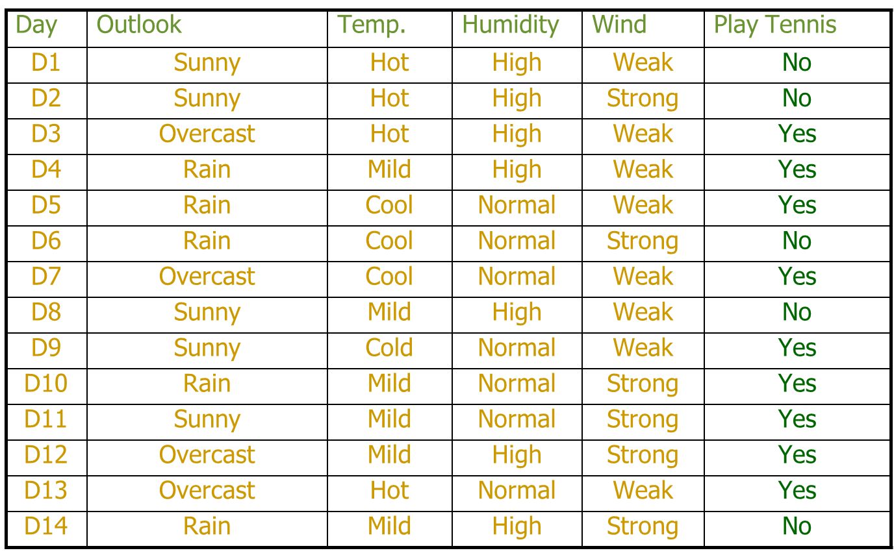
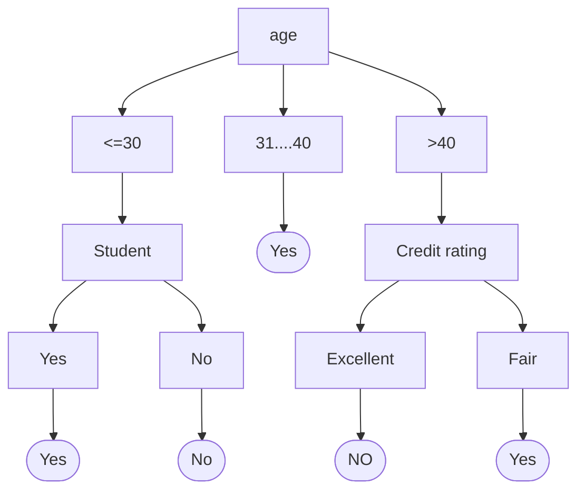

# Training Examples

```mermaid


graph TD

Outlook --> Sunny
Outlook --> Overcast
Outlook --> Rain

Sunny --> Humidity
Humidity --> High
Humidity --> Normal
High --> humNO
Normal --> humYes

Overcast --> overcastYes

Rain --> Wind

Wind --> Weak
Wind --> Strong


Weak --> windYes

Strong --> windHumidity

windHumidity --> windHumidityHigh
windHumidity --> windHumidityNormal

windHumidityHigh --> windHumityNO

windHumidityNormal --> Temparature

Temparature --> Cool
Temparature --> Mild

Cool --> tempNo
Mild --> tempYes


humNO([NO])
humYes([Yes])
overcastYes([Yes])
windYes([Yes])
windHumidity[Humidity]
windHumidityHigh[High]
windHumidityNormal[Normal]
windHumityNO([NO])
tempYes([Yes])
tempNo([No])


```

# Training Examples

A Decision Tree for “buys_computer”

```mermaid
graph TD

age --> A[<=30]
age --> B[31....40]
age --> C[>40]


A --> Student
Student --> Yes
Student --> No

Yes --> studentYes
No --> studentNo

B --> betWeen31And40

C --> D[Credit rating]
D --> E[Excellent]
D --> F[Fair]

E --> creditExcellentNO
F --> creditFairYes

betWeen31And40([Yes])
creditExcellentNO([NO])
creditFairYes([Yes])
studentYes([Yes])
studentNo([No])


```