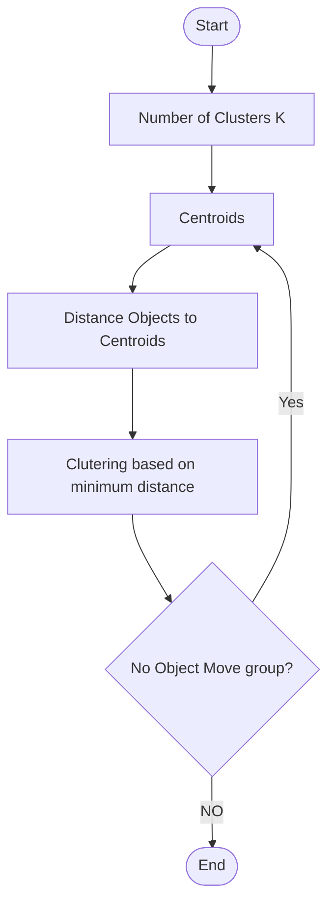

## K Means Clustering

K Means Clustering is one of the simplest and most popular 
unsupervised machine learning algorithms. Usually, it takes k as input and partitions the set into k subsets (clusters), and thus learns to which group an individual sample belongs. ‘Distance’ is measured with respect to the mean value of the positions of samples in a cluster, called ‘center of gravity’ or ‘centroid’. Comparatively lower intra-cluster ‘distance’ than intercluster

For a given k, initially k objects are selected randomly as centroids.

### Two major repeated steps:
- Data assignment step: Each data point is assigned to its nearest centroid.
- Centroid update step: Centroids are recomputed involving the current data points.

### Termination criteria
No data point changes its cluster; the sum of the distances is 
minimized; some maximum number of iterations is reached

## Flow Chart

## Example

### Given Data
| Object | Attribute 1 (X) | Attribute 2 (Y) |
| ------ | --------------- | --------------- |
| A      | 1               | 1               |
| B      | 2               | 1               |
| C      | 4               | 3               |
| D      | 5               | 4               |

### Answer

We have four samples. They are (1,1), (2,1), (4,3) and (5,4).Suppose, K = 2. Hence, have to group the samples into two clusters. 

Initially, randomly choose two centroids for two clusters. Centroid 1 = (1,1) for Cluster 1and Centroid 2 = (2,1) for Cluster 2
#### Data Assignment Step

Calculate distances for all samples from both centroids. (Formula: Euclidean Distance)

Sample Distance from Centroid 1 Distance from Centroid
2
Determined Cluster
(1,1) 0 1 Cluster 1
(2,1) 1 0 Cluster 2
(4,3) 3.61 2.83 Cluster 2
(5,4) 5 4.24 Cluster 2

| Sample | Distance from Centroid 1 | Distance from Centroid 2 | Determined Cluster |
| ------ | ------------------------ | ------------------------ | ------------------ |
| (1,1)  | 0                        | 1                        | Cluster 1          |
| (2,1)  | 1                        | 0                        | Cluster 2          |
| (4,3)  | 3.61                     | 2.83                     | Cluster 2          |
| (5,4)  | 5                        | 4.24                     | Cluster 2          |

#### Centroid Update Step

Compute the centroids for the clusters by taking the average of the all data points that belong to each cluster.

Cluster 1: (1,1)

Cluster 2: (2,1), (4,3), (5,4)

New Centroid 1 = (1,1)

New Centroid 2 = ((2+4+5)/3,(1+3+4)/3) = (3.67,2.67)

#### Data Assignment Step

Calculate distances for all samples from both centroids. (Formula: Euclidean Distance)

<!--  Make a table using the data above -->

| Sample | Distance from Centroid 1 | Distance from Centroid 2 | Determined Cluster |
| ------ | ------------------------ | ------------------------ | ------------------ |
| (1,1)  | 0                        | 3.14                     | Cluster 1          |
| (2,1)  | 1                        | 2.36                     | Cluster 1          |
| (4,3)  | 3.61                     | 0.47                     | Cluster 2          |
| (5,4)  | 5                        | 1.89                     | Cluster 2          |

#### Centroid Update Step

New Centroid 1 = ((1+2)/2,(1+1)/2) = (1.5,1)

New Centroid 2 = ((4+5)/2,(3+4)/2) = (4.5,3.5)

#### Data Assignment Step

Calculate distances for all samples from both centroids. (Formula: Euclidean Distance)

| Sample | Distance from Centroid 1 | Distance from Centroid 2 | Determined Cluster |
| ------ | ------------------------ | ------------------------ | ------------------ |
| (1,1)  | 0.5                      | 4.30                     | Cluster 1          |
| (2,1)  | 0.5                      | 3.54                     | Cluster 1          |
| (4,3)  | 3.20                     | 0.71                     | Cluster 2          |
| (5,4)  | 4.61                     | 0.71                     | Cluster 2          |

### Termination Criteria
In consecutive iterations, cluster for any sample has not changed. Hence, clustering has been 
done successfully.

| Sample | Distance from Centroid 1 | Distance from Centroid 2 | Determined Cluster |
| ------ | ------------------------ | ------------------------ | ------------------ |
| (1,1)  | 0.5                      | 4.30                     | Cluster 1          |
| (2,1)  | 0.5                      | 3.54                     | Cluster 1          |
| (4,3)  | 3.20                     | 0.71                     | Cluster 2          |
| (5,4)  | 4.61                     | 0.71                     | Cluster 2          |

