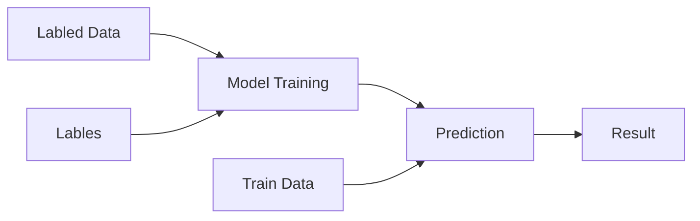
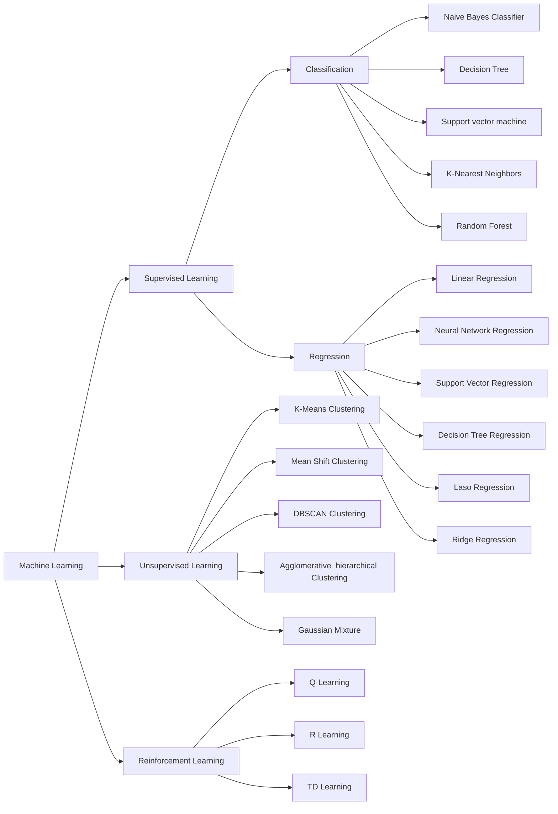
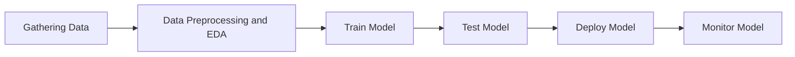

# Machine Learning Notes

## What is AI?
 Aritificial intelligence refers to systems or machines that mimic human intelligence to perform tasks and can iteratively improve themselves based on the information they collect.

## Defination
Machine learning is type of AI that allows software applications to become more accurate in predicting outcomes without being explicitly programmed to do so.

## Working Process

Machine learening algorithm is trained using a training data set to create a model. When new input data is introduced to the ML algorithm, it makes a prediction on the basis of the model. The prediction is evaluated for accuracy and if the accuracy is acceptable, the ML algorithm is deployed. If the accuracy is not acceptable, the ML algorithm is trained again and again with an augmented training data set. This is just a very high-level example as there are many factors and other steps involved.

## Areas

Machine learning is a subset of AI. Deep learning is a subset of machine learning.
Biology Inspired Algorithms is a subset of Ai which needs some part from both Deep learning and Machine learning.
Search Algorithms is a subset of Ai which isb't strictly related to machine learning.

In machine learning, we have three main areas:

Machine Learning 
- Supervised Learning
    - Classification
        - Naive Bayes Classifier
        - Decision Tree
        - Support vector machine
        - K-Nearest Neighbors
        - Random Forest

    - Regression
        - Linear Regression
        - Neural Network Regression
        - Support Vector Regression
        - Decision Tree Regression
        - Laso Regression
        - Ridge Regression

- Unsupervised Learning
    - K-Means Clustering
    - Mean Shift Clustering
    - DBSCAN Clustering
    - Agglomerative  hierarchical Clustering
    - Gaussian Mixture 
- Reinforcement Learning
    - Q-Learning
    - R Learning
    - TD Learning

Draw a ven diagram of the above 

### Supervised Learning

In supervised learning the machine si taught by example. The operator provides machine learning algorithm with a known dataset that includes desired inputs and outputs , and the algorithm must find a method to determine how to arrive at those inputs and outputs.

Types of Supervised Learning
- Classification
- Regression

The main difference between regression and classification algorithms that regression algorithms are used to predict continious values such as price , salary , age etc. and classification algorithms are used to predict/clssify the discrete values such as male or female , true or false , spam or not spam etc.

### Unsupervised Learning

Unsupervised learning works by analyzing the data without its labels for the structure within it and through determining the correlations , and for features that actually correlate two data items. It can be used for clustering .

### Reinforcement Learning

Reinforcement learning is a type of machine learning training method based on rewarding the desired behaviour and/or punishing the undesired ones. In general , a reinforcement learning agent is able to perceive and interpret its environment , take actions and learn through trial and error. Some of the autonomous driving tasks where reinforcement learning could be applied include trajectory optimization, motion planning, dynamic pathing, controller optimization, and scenario-based learning policies for highways. For example, parking can be achieved by learning automatic parking policies

## Life Cycle

## Dataset

### Datasets for supervised learning
#### Regression

<!-- A table where there will be 5 featured named as RAM , storage , Weight , Display , Price here price is the Target feature  -->

| RAM | Storage | Weight | Display | Price |
| --- | ------- | ------ | ------- | ----- |
| 4   | 64      | 1.5    | 5.5     | 10000 |
| 6   | 128     | 1.6    | 6.5     | 15000 |
| 8   | 256     | 1.7    | 7.5     | 20000 |
| 10  | 512     | 1.8    | 8.5     | 25000 |
| 12  | 1024    | 1.9    | 9.5     | 30000 |

Now Given any four property above we should be able to predict the other property of the device. This is called regression as each of them is a continious value.

#### Classification

Now if we add another column to the above dataset Named as Price Category which will haev three option
- Cheap
- Medium
- Expensive

Then we can call it a classification problem as the price category is a discrete value.
| RAM | Storage | Weight | Display | Price | Price Category |
| --- | ------- | ------ | ------- | ----- | -------------- |
| 4   | 64      | 1.5    | 5.5     | 10000 | Cheap          |
| 6   | 128     | 1.6    | 6.5     | 15000 | Cheap          |
| 8   | 256     | 1.7    | 7.5     | 20000 | Medium         |
| 10  | 512     | 1.8    | 8.5     | 25000 | Medium         |
| 12  | 1024    | 1.9    | 9.5     | 30000 | Expensive      |

### Dataset for Unsupervised Learning
| RAM | Storage | Weight | Display | 
| --- | ------- | ------ | ------- |
| 4   | 64      | 1.5    | 5.5     | 
| 6   | 128     | 1.6    | 6.5     | 
| 8   | 256     | 1.7    | 7.5     | 
| 10  | 512     | 1.8    | 8.5     | 
| 12  | 1024    | 1.9    | 9.5     |

## Train /Test

Train /test is a method to measuere the accuracy of the model . It is called train/test because the data set is split into two sets : a training set and a testing set. 
    
    "Train The model on the training set and test the model on the testing set"

### K-Fold Cross Validation

In k -fold cross validation , the original sample is randomly partitioned into k equal sized subsamples.  Of the k subsamples, a single subsample is retained as the validation data for 
testing the model, and the remaining k − 1 subsamples are used as training data. The crossvalidation process is then repeated k times, with each of the k subsamples used exactly once as the validation data. The k results can then be averaged to produce a single estimation.

## Fit

### overfitting

In Machine Learning, overfitting is the case where the predictor model fits perfectly on the training examples, but does badly on the test examples.This often happens when the model is too complex and trivially fits the data (too many parameters), or when there is not enough data to accurately estimate the parameters. That is, when the ratio of 
model complexity to training set size is too high, overfitting will typically occur.

    "Overfitting is like learning through memorization. Rather than understanding the concepts at play and making generalizations you simply recall what you’ve seen before and find the closest thing to what you already know. This means that while your model will perform very well on the training set by memorizing what it should do with each input, when it is faced with an input it has never seen before it won’t have any general concepts to fall back on"

### underfitting

Underfitting refers to a model that can neither model the training data nor generalize to new data. An underfit machine learning model is not a suitable model and will be obvious as it will have poor performance on the training data. Underfitting is often not discussed as it is easy to detect given a good performance metric. The remedy is to move on and try alternate machine learning algorithms. 

## Application

1. Automatic Language Translation in Google Translate
2. Faster route selection in Google Map
3. Driverless/Self-driving car
4. Smartphone with face recognition
5. Speech Recognition
6. Ads Recommendation System
7. Netflix Recommendation System
8. Auto friend tagging suggestion in Facebook
9. Stock market trading
10. Fraud Detection
11. Weather Prediction
12. Medical Diagnosis
13. Chatbot
14. Machine Learning in Agriculture

## Benifits
1. Work Automation
2. Powerful predictive Ability
3. Increased in sales in the e-commerce market
4. Enhances medical diagnosis, drug development
5. Robotic medical surgery
6. Increases productivity enhances revenue and gives secure transactions
7. Modeling the data to make useful decisions