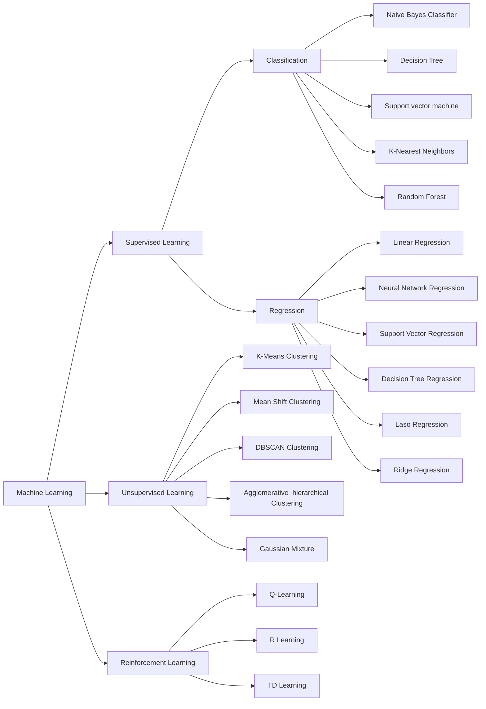

# Machine Learning Notes

## Areas of machine Learning

Machine learning is a subset of AI. Deep learning is a subset of machine learning.
Biology Inspired Algorithms is a subset of Ai which needs some part from both Deep learning and Machine learning.
Search Algorithms is a subset of Ai which isb't strictly related to machine learning.

In machine learning, we have three main areas:

Machine Learning 
- Supervised Learning
    - Classification
        - Naive Bayes Classifier
        - Decision Tree
        - Support vector machine
        - K-Nearest Neighbors
        - Random Forest

    - Regression
        - Linear Regression
        - Neural Network Regression
        - Support Vector Regression
        - Decision Tree Regression
        - Laso Regression
        - Ridge Regression

- Unsupervised Learning
    - K-Means Clustering
    - Mean Shift Clustering
    - DBSCAN Clustering
    - Agglomerative  hierarchical Clustering
    - Gaussian Mixture 
- Reinforcement Learning
    - Q-Learning
    - R Learning
    - TD Learning

Draw a ven diagram of the above 

